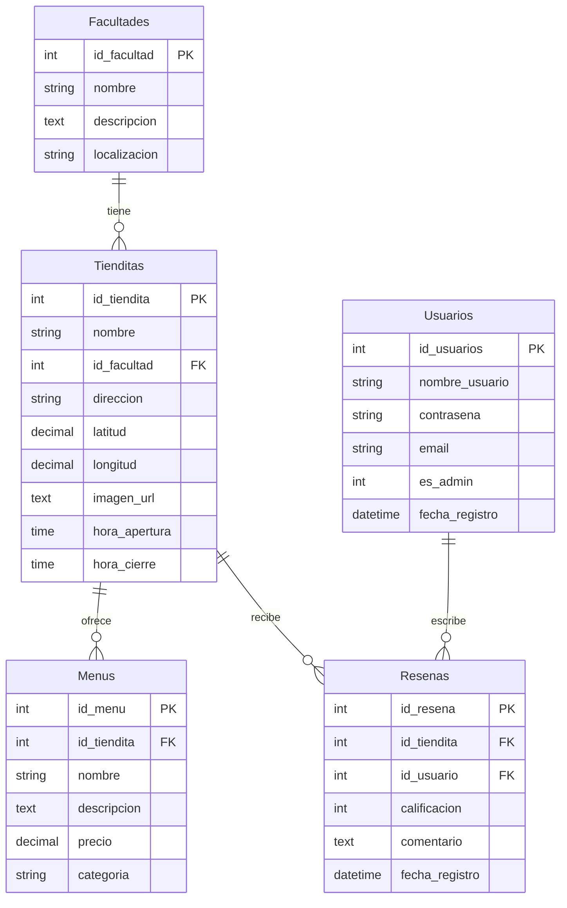

# 🦉 El Búho Tragón — Ingeniería de Software II

> **Asistente Inteligente y Guía Gastronómica para la Universidad de Sonora.**

Proyecto desarrollado para la materia de **Ingeniería de Software II**, enfocado en centralizar la información de los menús, precios y ubicaciones de las cafeterías universitarias, potenciado por un asistente de IA (RAG).

---


---

## 📑 Índice

1. [Descripción del Proyecto](#-descripción-del-proyecto)
2. [Arquitectura y Tecnologías](#️-arquitectura-y-tecnologías)
3. [Estructura del Repositorio](#-estructura-del-repositorio)
4. [Modelo de Datos](#️-modelo-de-datos)
5. [Instalación y Uso](#️-instalación-y-uso)
    1. [Prerrequisitos Globales](#prerrequisitos-globales)
    2. [Base de Datos (SQLite)](#1-base-de-datos-sqlite)
    3. [Backend (Django)](#2-backend-django)
    4. [Frontend (React)](#3-frontend-react)
    5. [Módulo de IA (RAG Engine)](#4--módulo-de-ia-rag-engine)
6. [Endpoints de la API](#-endpoints-de-la-api)
7. [Variables de Entorno](#-variables-de-entorno)
8. [Despliegue](#-despliegue)
9. [Contribuciones](#-contribuciones)
10. [Licencia](#-licencia)

---

## 🦉 Descripción del Proyecto

**El Búho Tragón** resuelve el problema de la dispersión de información alimenticia en el campus. Permite a los estudiantes:
* Consultar menús actualizados de todas las cafeterías.
* Ver ubicaciones y horarios.
* Visualizar las cafeterías en un mapa interactivo del campus.
* Dejar reseñas y calificaciones sobre las cafeterías.
* **Interactuar con un Chatbot de IA:** Un sistema RAG (Retrieval-Augmented Generation) que responde preguntas como *"¿Dónde venden Torta Cubana más barata?"* o *"¿Qué cafetería está abierta ahorita cerca de Ingeniería?"*.

---

## ⚙️ Arquitectura y Tecnologías

### 🔧 Backend
- **Lenguaje:** Python 3.10+
- **Framework:** Django 5.x + Django REST Framework
- **Autenticación:** JWT (Simple JWT)
- **Base de Datos:** SQLite (desarrollo) / MySQL (producción)
- **Filtrado:** django-filter

### 🎨 Frontend
- **Framework:** React 19 + Vite 6
- **Estilos:** TailwindCSS 4
- **Lenguaje:** JavaScript (ES6+)
- **Routing:** React Router DOM 7
- **Mapas:** Leaflet + React-Leaflet
- **Iconos:** React Icons

### 🧠 Inteligencia Artificial
- **Arquitectura:** RAG (Retrieval-Augmented Generation)
- **Embeddings:** sentence-transformers (`all-MiniLM-L6-v2`)
- **Vector Store:** FAISS (Facebook AI Similarity Search)
- **LLM (local):** Qwen2.5-1.5B-Instruct (optimizado para CPU)
- **LLM (HPC):** Qwen2.5-14B-Instruct (AMD GPU con ROCm)
- **Infraestructura HPC:** Clúster Yuca — ACARUS, Universidad de Sonora
- **Librerías:** PyTorch, Transformers, HuggingFace

---

## 📁 Estructura del Repositorio

```
IS2_ElBuhoTragon/
├── backend/                    # API REST en Django
│   ├── apps/
│   │   ├── cafeteria/          # App principal (modelos, vistas, serializers)
│   │   └── chatbot/            # Integración del chatbot
│   ├── config/                 # Configuración de Django (settings, urls)
│   ├── export_for_rag.py       # Script para exportar datos al módulo RAG
│   ├── import_to_sqlite.py     # Script para importar datos a SQLite
│   └── requirements.txt        # Dependencias del backend
│
├── frontend/                   # Cliente web en React
│   ├── src/
│   │   ├── components/         # Componentes reutilizables
│   │   │   ├── Header.jsx      # Barra de navegación
│   │   │   ├── Footer.jsx      # Pie de página
│   │   │   ├── ChatWidget.jsx  # Widget del chatbot de IA
│   │   │   ├── CampusMap.jsx   # Mapa interactivo del campus
│   │   │   ├── CafeCard.jsx    # Tarjeta de cafetería
│   │   │   └── CafeCardGlass.jsx
│   │   ├── pages/              # Páginas de la aplicación
│   │   │   ├── Home.jsx        # Página principal
│   │   │   ├── Cafeterias.jsx  # Listado de cafeterías
│   │   │   ├── PlantillaCafeteria.jsx  # Detalle de cafetería
│   │   │   ├── Facultad.jsx    # Información de facultad
│   │   │   ├── Login.jsx       # Inicio de sesión
│   │   │   ├── Registro.jsx    # Registro de usuarios
│   │   │   ├── AdminDashboard.jsx  # Panel de administración
│   │   │   ├── Contacto.jsx    # Página de contacto
│   │   │   ├── Terminos.jsx    # Términos y condiciones
│   │   │   └── Privacidad.jsx  # Política de privacidad
│   │   ├── App.jsx
│   │   └── main.jsx            # Punto de entrada y rutas
│   └── package.json
│
├── llm_rag/                    # Motor de Inteligencia Artificial
│   ├── rag_engine.py           # Motor RAG (desarrollo local, CPU)
│   ├── rag_engine_hpc.py       # Motor RAG de producción (ACARUS Yuca, AMD GPU/ROCm)
│   ├── rag_data_fixed.json     # Datos vectorizados de cafeterías
│   ├── requirements.txt        # Dependencias del módulo IA
│   └── README.md               # Documentación detallada del RAG
│
├── sql/                        # Scripts de Base de Datos
│   ├── Facultades.sql          # Datos de facultades
│   ├── Tienditas.sql           # Datos de cafeterías
│   ├── Menus.sql               # Datos de menús
│   ├── Usuarios.sql            # Datos de usuarios
│   └── respaldo_completo.sql   # Respaldo completo de la BD
│
├── docs/                       # Documentación y diagramas
├── requirements.txt            # Dependencias globales del proyecto
├── LICENSE                     # Licencia GPL v3
└── README.md                   # Este archivo
```

---

## 🗄️ Modelo de Datos



---

## 🛠️ Instalación y Uso

### Prerrequisitos Globales
- **Python** 3.10+
- **Node.js** 18+
- **Git**

### 1. Base de Datos (SQLite)

El proyecto viene preconfigurado con **SQLite** para desarrollo. La base de datos `el_buho_tragon.db` se incluye en el directorio `backend/`.

Si deseas partir de cero, puedes importar los datos desde los scripts SQL:

```bash
cd backend
python import_to_sqlite.py
```

> **Nota:** Para producción con MySQL, modifica `DATABASES` en `backend/config/settings.py` y ejecuta los scripts de `/sql/` en tu servidor MySQL.

### 2. Backend (Django)

```bash
# Clonar el repositorio
git clone https://github.com/OwenSolis03/IS2_ElBuhoTragon.git
cd IS2_ElBuhoTragon/backend

# Crear entorno virtual
python -m venv venv

# Activar entorno virtual
# Windows:
venv\Scripts\activate
# Linux / macOS:
source venv/bin/activate

# Instalar dependencias
pip install -r requirements.txt

# Crear archivo de variables de entorno
# (Ver sección "Variables de Entorno" más abajo)
cp .env.example .env  # o crear manualmente

# Aplicar migraciones
python manage.py migrate

# Crear superusuario (opcional, para panel de admin)
python manage.py createsuperuser

# Iniciar servidor de desarrollo
python manage.py runserver
```

El backend estará disponible en `http://127.0.0.1:8000/`.

### 3. Frontend (React)

```bash
# En otra terminal, desde la raíz del proyecto
cd frontend

# Instalar dependencias
npm install

# Iniciar servidor de desarrollo
npm run dev
```

El frontend estará disponible en `http://localhost:5173/`.

### 4. 🤖 Módulo de IA (RAG Engine)

```bash
cd llm_rag

# Instalar dependencias (requiere ~2-3 GB para modelos)
pip install -r requirements.txt

# Probar el sistema de forma independiente (desarrollo local)
python rag_engine.py

# En el clúster Yuca de ACARUS (producción)
python rag_engine_hpc.py
```

> **Nota:** La primera ejecución descarga los modelos de HuggingFace. En local (~2.5 GB, modelo 1.5B); en ACARUS Yuca (~28 GB, modelo 14B). Las consultas subsecuentes son más rápidas (~2-5 seg).

> En producción se utiliza `rag_engine_hpc.py`, que ejecuta **Qwen2.5-14B-Instruct** sobre GPU AMD con ROCm en el clúster **Yuca** del Área de Cómputo de Alto Rendimiento de la Universidad de Sonora (**ACARUS**).

Para más detalles, consulta la [documentación del módulo RAG](./llm_rag/README.md).

---

## 🌐 Endpoints de la API

| Método | Endpoint | Descripción |
|--------|----------|-------------|
| `GET` | `/api/Tienditas/` | Listar todas las cafeterías |
| `GET` | `/api/Tienditas/{id}/` | Detalle de una cafetería |
| `GET` | `/api/Menus/` | Listar todos los menús |
| `GET` | `/api/Menus/?id_tiendita={id}` | Menús filtrados por cafetería |
| `GET` | `/api/Facultades/` | Listar todas las facultades |
| `GET` | `/api/Usuarios/` | Listar usuarios |
| `GET` | `/api/Resenas/` | Listar reseñas |
| `POST` | `/api/register` | Registro de nuevo usuario |
| `POST` | `/api/login/` | Inicio de sesión |
| `POST` | `/api/token` | Obtener token JWT |
| `POST` | `/api/token/refresh/` | Refrescar token JWT |
| `POST` | `/api/chatbot/` | Consulta al asistente de IA |

> La API incluye paginación, filtrado (`django-filter`) y búsqueda configurables a través de Django REST Framework.

---

## 🔐 Variables de Entorno

Crea un archivo `.env` en el directorio `backend/` con las siguientes variables:

```env
# Django
DJANGO_SECRET_KEY=tu-clave-secreta-aqui

# URL de la API (opcional, default: http://127.0.0.1:8000)
API_URL=http://127.0.0.1:8000
```

---

## 🚀 Despliegue

### Clúster Yuca — ACARUS (Universidad de Sonora)

El sistema de producción se ejecuta en el clúster **Yuca** del Área de Cómputo de Alto Rendimiento de la Universidad de Sonora (**ACARUS**), aprovechando GPU AMD con ROCm para ejecutar el modelo Qwen2.5-14B-Instruct.

```bash
# 1. Conectar al clúster
ssh usuario@yuca.acarus.uson.mx

# 2. Clonar/actualizar el repositorio
cd ~/IS2_ElBuhoTragon
git pull origin test

# 3. Instalar dependencias del backend (versión HPC)
cd backend
pip install -r requirements_hpc.txt
python manage.py migrate

# 4. Instalar dependencias del RAG
cd ../llm_rag
pip install -r requirements.txt

# 5. Construir el frontend para producción
cd ../frontend
npm install
npm run build

# 6. Iniciar el servidor
cd ../backend
python manage.py runserver 0.0.0.0:8000
```

### Acceso remoto vía SSH Tunnel

```bash
ssh -L 8000:localhost:8000 usuario@yuca.acarus.uson.mx
# Accede desde tu navegador en http://localhost:8000
```

---

## 🤝 Contribuciones

1. Haz un **fork** del repositorio.
2. Crea una rama para tu funcionalidad: `git checkout -b feature/nueva-funcionalidad`
3. Haz commit de tus cambios: `git commit -m "Agregar nueva funcionalidad"`
4. Sube tu rama: `git push origin feature/nueva-funcionalidad`
5. Abre un **Pull Request** hacia la rama `test`.

### Convenciones
- Mantén el código en **español** (nombres de variables, modelos, comentarios).
- Sigue la estructura de carpetas existente.
- Prueba tus cambios antes de abrir un PR.

---

## 📄 Licencia

Este proyecto está licenciado bajo la **GNU General Public License v3.0**.
Consulta el archivo [LICENSE](./LICENSE) para más detalles.

---

<p align="center">
  Hecho con ❤️ por el equipo de <strong>El Búho Tragón</strong> — Universidad de Sonora, 2025
</p>